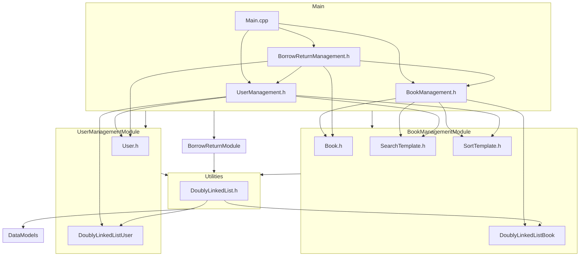

    

    <b>Automatic Architecture Diagrams from Code</b> 
    <a href="https://github.com/swark-io/swark">GitHub</a> • <a href="https://swark.io">Website</a> • <a href="mailto:contact@swark.io">Contact Us</a>

## Usage Instructions

1. **Render the Diagram**: Use the links below to open it in Mermaid Live Editor, or install the [Mermaid Support](https://marketplace.visualstudio.com/items?itemName=bierner.markdown-mermaid) extension.
2. **Recommended Model**: If available for you, use `claude-3.5-sonnet` [language model](vscode://settings/swark.languageModel). It can process more files and generates better diagrams.
3. **Iterate for Best Results**: Language models are non-deterministic. Generate the diagram multiple times and choose the best result.

## Generated Content
**Model**: GPT-4o - [Change Model](vscode://settings/swark.languageModel)  
**Mermaid Live Editor**: [View](https://mermaid.live/view#pako:eNqNVcuSgjAQ_BUqZ_UDOOzB5aiXVU-bPUQYJSUkqZDUlmX57xsWH0wYBU5kptNDenrCheW6AJYyro5WmDLZZlwl4Wn8vgushVRdqH3a1acx35y1b4vcGM5-BulkPv9Illqf1kKJI9SgHI3ZNWDHMEttrf79AuetirGgCq6iD8Z117rwFTyZcTacAwcWJToPTj6O9RaQab-vziupTlCsZONGN2xA2LzcQm0q4eA9VFuHgZQCWNVYAZwNCuBApABOPpr2FhArMLrhlQIUdJICyDMDB1B--ncClRg4ggKRzngJxHqMMFLjMcI9ZUp2TlbSSWierLgLQRAciIToN6LF9pYRMrZDQMehkR0T5mrSlqfwlCSZcCKYBaoGz-DtkiAG4zY8vUyPt73DiC727fiAvJ7YHgttaYq948QdpkpQuGEdku2-7HTuKcdmrAZbC1mEv8qFM1eGgpylCWcFHISvHGfXAPKmCFbJpAji1yx11sOMCe_05qzy-9pqfyxZehBVA9c_ZhQyIg) | [Edit](https://mermaid.live/edit#pako:eNqNVcuSgjAQ_BUqZ_UDOOzB5aiXVU-bPUQYJSUkqZDUlmX57xsWH0wYBU5kptNDenrCheW6AJYyro5WmDLZZlwl4Wn8vgushVRdqH3a1acx35y1b4vcGM5-BulkPv9Illqf1kKJI9SgHI3ZNWDHMEttrf79AuetirGgCq6iD8Z117rwFTyZcTacAwcWJToPTj6O9RaQab-vziupTlCsZONGN2xA2LzcQm0q4eA9VFuHgZQCWNVYAZwNCuBApABOPpr2FhArMLrhlQIUdJICyDMDB1B--ncClRg4ggKRzngJxHqMMFLjMcI9ZUp2TlbSSWierLgLQRAciIToN6LF9pYRMrZDQMehkR0T5mrSlqfwlCSZcCKYBaoGz-DtkiAG4zY8vUyPt73DiC727fiAvJ7YHgttaYq948QdpkpQuGEdku2-7HTuKcdmrAZbC1mEv8qFM1eGgpylCWcFHISvHGfXAPKmCFbJpAji1yx11sOMCe_05qzy-9pqfyxZehBVA9c_ZhQyIg)

